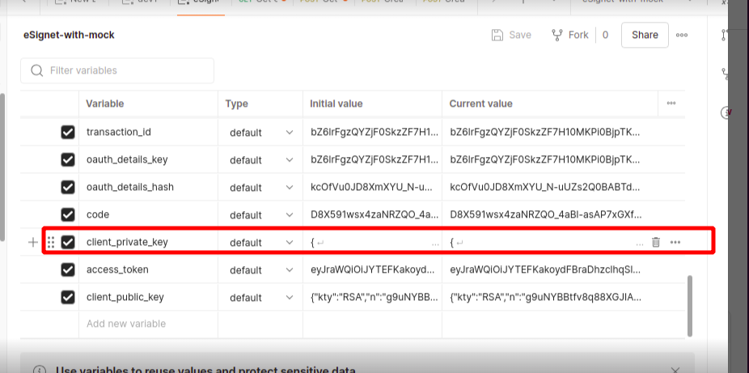

# Esignet Deployment in Kubernetes Environment
## Overview
* This guide will walk you through the deployment process of the Esignet application.
* The setup involves creating
  * Kubernetes cluster
  * Setting up Nginx
  * Installing Istio
  * Configuring storage class
  * Configuring the necessary dependent services
  * Deploying Esignet services
## Deployment
### K8 cluster
* Kubernetes cluster should be ready with storage class and ingress configured properly.
* Below is the document containing steps to create and configure K8 cluster.
  * __Onprem RKE CLuster__ : Create RKE K8 cluster using mentioned [steps](https://github.com/mosip/k8s-infra/tree/v1.2.0.2/mosip/on-prem#mosip-k8s-cluster-setup-using-rke).
      * __Persistence__ : Setup storage class as per [steps](https://github.com/mosip/k8s-infra/tree/v1.2.0.1/mosip/on-prem#storage-classes).
      * __Istio service mesh__ : Setup Istio service mesh using [steps](https://github.com/mosip/k8s-infra/tree/v1.2.0.2/mosip/on-prem#istio-for-service-discovery-and-ingress).
      * __Nginx__ : Setup and configure nginx as per [steps](https://github.com/mosip/k8s-infra/blob/v1.2.0.2/mosip/on-prem/nginx).
      * __Logging__ : Setup logging as per [steps](https://github.com/mosip/k8s-infra/tree/v1.2.0.2/logging).
      * __Monitoring__ : Setup monitoring consisting elasticsearch, kibana, grafana using [steps](https://github.com/mosip/k8s-infra/tree/v1.2.0.2/monitoring).
  * __AWS EKS cluster__ : Create AWS EKS cluster using mentioned [steps](https://github.com/mosip/k8s-infra/tree/main/mosip/aws#mosip-cluster-on-amazon-eks).
      * __Persistence__ : Setup storage class as per [steps](https://github.com/mosip/k8s-infra/tree/main/mosip/aws#persistence).
      * __Ingress and Loadbalancer__ : Setup nginx and configure NLB for exposing services outside using [steps](https://github.com/mosip/k8s-infra/tree/main/mosip/aws#ingress-and-load-balancer-lb).
      * __Logging__ : Setup logging as per [steps](https://github.com/mosip/k8s-infra/tree/v1.2.0.2/logging).
      * __Monitoring__ : Setup monitoring consisting elasticsearch, kibana, grafana using [steps](https://github.com/mosip/k8s-infra/tree/v1.2.0.2/monitoring).
### Install Pre-requisites
* `esignet-global` configmap: For eSignet K8's env, `esignet-global` configmap in `esignet` namespace contains Domain related information. Follow below steps to add domain details for `esignet-global` configmap.
  * Copy `esignet-global-cm.yaml.sample` to `esignet-global-cm.yaml`.
     ````
      cp esignet-global-cm.yaml.sample esignet-global-cm.yaml
     ````
  * Update the domain names in `esignet-global-cm.yaml` correctly for your environment.
  * Create a google recaptcha v2 ("I am not a Robot") from Google with required domain name ex:[sandbox.mosip.net] [Recaptcha Admin](https://www.google.com/recaptcha/about/) and set esignet captcha.
  * External IAM scope:
     * If using an external IAM, copy the secrets from the external IAM and create a secret named keycloak-client-secrets in the esignet namespace.
    
  ### Note: When deploying multiple plugins in the same cluster, a few manual changes are required in the deployment scripts:
    ##### If you are deploying a single plugin in a cluster, these changes are not required.
  - Update the **namespace** in the `install-prereq.sh` script according to the plugin being deployed.
  - Update the **namespace** and **mosip-esignet-host domain** in the `esignet-global.yaml` scripts according to the plugin being deployed.
  - Update the **namespace** in the `install.sh` script according to the plugin being deployed.
  - Update the **namespace** and **esignet service name** in the `esignet-with-plugin install.sh` script according to the plugin being deployed.
  - Update the **namespace**, **OIDC service name**, and **esignet service name** in the `oidc-ui install.sh` script according to the plugin being deployed.
  - Update the **namespace** and **esignet service name** in the `partner-onboarder` install script if these values are changed for the `mosip identity plugin`.
    * Example: Sunbird Plugin Deployment
      *  namespace: esignet-sunbird
      *  mosip-esignet-host: esignet-sunbird.sandbox.mosip.net
      *  esignet service name: esignet-sunbird
      *  oidc service name: oidc-ui-sunbird
      
### Install pre-requisites
  ```
  ./install-prereq.sh
  ```
### Initialise pre-requisites
* Update values file for postgres init [here](postgres/init_values.yaml).
* Execute `initialise-prereq.sh` script to initialise postgres and keycloak.
  ```
  ./initialise-prereq.sh
  ```
### Install esignet and oidc
During deployment, the system will prompt for user input to select the appropriate plugin. The available options are listed below:
1. esignet-mock-plugin
2. mosip-identity-plugin
3. sunbird-rc-plugin
4. custom-plugin"
```
./install-esignet.sh
```
## Onboarder
* There are two ways to proceed, either with mosip identity plugin or with mock plugin.
### MOSIP Identity Plugin
* If Esignet is getting deployed with MOSIP then we need to execute the onboarder for MISP partner and mock-rp oidc clientId.
* Onboarder [scripts](../partner-onboarder/).

### MOCK Plugin
Download and import eSignet-with-mock.postman_environment.json and eSignet.postman_collection.json postman collection from [here](../postman-collection))
# OIDC Client Management Instructions
1. Fetch the Authentication Token
   Navigate to "OIDC Client Mgmt" → "Mock" → "Get Auth Token" to retrieve the authentication token.
   * Update the client_secret (retrieve it from the keycloak-client-secrets).
   * Update the iam_url (Keycloak URL) in the request body.
     * Retrieve the Keycloak URL from the config-map under keycloak-host → keycloak-external-url.
2. Fetch the CSRF Token
   * Navigate to "OIDC Client Mgmt" → "Mock" → "Get CSRF Token" to obtain the CSRF token.
   * Update the "url" to ge the CSRF Token. 
3. Update the Request Fields for OIDC Client Creation
   * Before executing the "Create OIDC Client" request, update the following fields in the request body:
     * url
     * logo-uri
     * redirect-uri
     * client-name
     * client-id
4. Update the clientId in Deployment
   * Once the clientId is created and activated, update the clientId in the mock-relying-party-ui deployment.
5. Update the Client Private Key
   * Retrieve the `client-private-key` from the **eSignet-with-mock** Postman environment, as shown in the image below:
     * 
     * Encode the retrieved `client-private-key` using Base64.
     * Update the Base64-encoded `client-private-key` in the **mock-relying-party service secret**.

### NOTE:
This deployment is limited to mock
Below section related to configuring IDA is not tested. Still it can be tried out

### CONFIGURE IDA for Esignet :
Onboard eSignet as MISP partner in MOSIP PMS using our onboarder script
We should override properties defined [here](https://github.com/mosip/esignet-plugins/blob/release-1.3.x/mosip-identity-plugin/src/main/resources/application.properties)  if there is any change in the MOSIP IDA domain names.
Update the 'MOSIP_ESIGNET_AUTHENTICATOR_IDA_SECRET_KEY' property with MOSIP IDA keycloak client secret.
