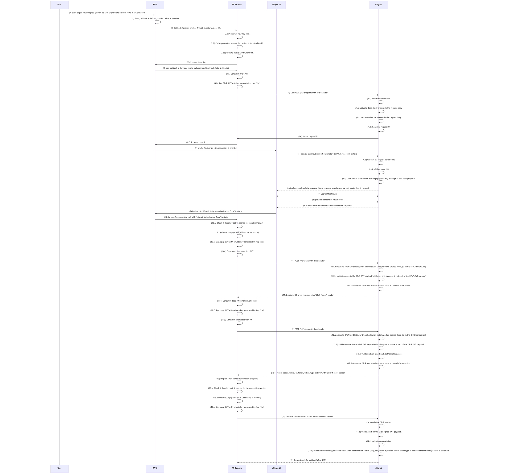
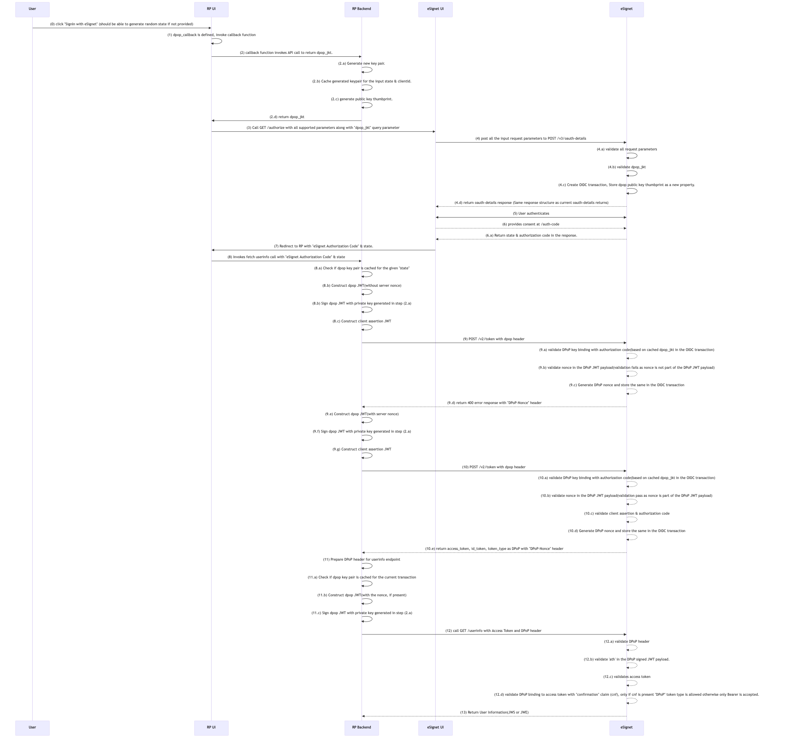

# DPoP (Demonstration of Proof-of-Possession) in eSignet OIDC

DPoP is an OAuth 2.0 extension defined in [RFC 9449](https://datatracker.ietf.org/doc/html/rfc9449) that proves a client possesses a private key when presenting an access token, preventing stolen tokens from being replayed by unauthorized parties.

eSignet uses DPoP to bind access tokens and authorization codes to a client-held key pair, so that a stolen token cannot be replayed by an attacker who does not also possess the private key. This is required by the [FAPI 2.0 Baseline Profile](https://openid.net/specs/fapi-2_0-baseline.html).

---

## Table of Contents

- [Background](#background)
- [How It Works](#how-it-works)
- [Prerequisites](#prerequisites)
- [Configuration](#configuration)
  - [1. Client Registration](#1-client-registration)
  - [2. Configure the Relying Party (Mock RP)](#2-configure-the-relying-party-mock-rp)
- [Verification](#verification)
- [Troubleshooting](#troubleshooting)
- [Notes & Future Improvements](#notes--future-improvements)

---

## Background

A standard OAuth 2.0 / OIDC access token is a **bearer token**: anyone who presents it can use it. If a token leaks — through a misconfigured proxy, an XSS exfiltration, a verbose log, or a man-in-the-middle on a poorly configured TLS link — the attacker has the same access as the legitimate client until the token expires.

**DPoP** raises the bar by binding a token to a public key the client demonstrates possession of. On every protected request, the client must attach a fresh, signed **DPoP proof JWT** in the `DPoP` HTTP header. The authorization server and the resource server check that:

1. The proof is signed with the private key matching the public key the token was bound to (via the `cnf.jkt` confirmation claim).
2. The proof targets *this* request (HTTP method and URL).
3. For protected-resource calls, the proof references *this* access token (via the `ath` claim).

**Default behavior (bearer):**

```text
Client --> Authorization: Bearer <token>     (anyone with token can use it)
```

**With DPoP enabled:**

```text
Client --> Authorization: DPoP <token>
           DPoP: <signed proof JWT>          (only holder of the private key can use it)
```

Security benefits:

- Stolen access tokens cannot be replayed without the corresponding private key.
- Authorization codes can also be bound to the key, mitigating code-injection attacks at the token endpoint.
- Server-issued **nonces** prevent pre-generation and replay of DPoP proofs.
- Required for FAPI 2.0 conformance.

---

## How It Works

eSignet supports DPoP-binding of both **authorization codes** and **access tokens**. The flow integrates with the standard authorization-code grant and works with or without [PAR](./par-usage.md).

### Phase 1 — Bind the authorization code to the client key

1. The user initiates login at the RP using the client ID.
2. The client provides the public-key thumbprint to eSignet at the start of the flow, in one of two ways:
   - **With PAR:** include `dpop_jkt` as a query parameter or send a `DPoP` header on the `/par` call.
   - **Without PAR:** include `dpop_jkt` as a query parameter on the `/authorize` call.
3. eSignet validates the request and stores the `dpop_jkt` in the OIDC transaction cache. This stored value acts as a binding between the public-key thumbprint and the authorization code that will be issued.
4. eSignet authenticates the user, captures consent, and returns the authorization code to the client.

### Phase 2 — Exchange the code for a DPoP-bound access token

1. The client calls `/v2/token` with the authorization code and a `DPoP` header containing a freshly signed proof JWT.
2. eSignet validates the DPoP header and, if a binding was recorded in Phase 1, verifies that the proof's public-key thumbprint matches the stored `dpop_jkt`.
    - If the binding check fails, the request is rejected **even when `dpop_bound_access_tokens` is `false`** for the client.
    - If `dpop_bound_access_tokens` is `true` and the DPoP header is missing or the binding check fails, the request is rejected.
    - If the authorization code was DPoP-bound at Phase 1, attempting to exchange it using the `Bearer` scheme (or with no DPoP proof at all) is **always rejected**, regardless of whether `dpop_bound_access_tokens` is `true` or `false`. Once a code is bound, the binding is non-optional.
3. **Nonce handshake:** eSignet always rejects the first token request and responds with a `dpop_nonce` header. The client must retry the token request with a new DPoP proof JWT that includes the `nonce` claim.
4. On success, eSignet returns an access token with:
    - `token_type` set to `DPoP`
    - a `cnf.jkt` claim (confirmation method) holding the public-key thumbprint the token is bound to.

### Phase 3 — Use the DPoP-bound access token

1. The client calls `/userinfo` with the access token and a fresh `DPoP` header for that request.
2. eSignet's DPoP validation filter checks the proof's JWT structure, claims, and signature, and verifies the binding between the access token (`cnf.jkt`) and the proof's public-key thumbprint, including the access-token hash claim (`ath`).
3. On success, eSignet returns the user information. On failure, an RFC-compliant DPoP error response is returned.

> Like the token endpoint, eSignet may challenge a `/userinfo` request with a `DPoP-Nonce` response header (RFC 9449 §8). When this happens, the client must retry with a new DPoP proof JWT that includes the returned `nonce` claim. Clients should treat the nonce dance as possible on **any** DPoP-protected endpoint, not just `/v2/token`.

### Phase 4 — Refresh a DPoP-bound token (when refresh tokens are issued)

Per [RFC 9449 §5](https://datatracker.ietf.org/doc/html/rfc9449#section-5), refresh tokens issued in a DPoP flow are bound to the same public key as the access token they were issued with. When the deployment issues refresh tokens to a DPoP-bound client:

1. The client calls `/v2/token` with `grant_type=refresh_token`, the refresh token, and a fresh `DPoP` header signed with the **same key pair** used at Phase 1.
2. eSignet verifies the proof, the binding to the refresh token, and the nonce (re-applying the nonce handshake if challenged).
3. eSignet returns a new DPoP-bound access token. Any newly issued refresh token is bound to the same key.

> Refresh-token issuance depends on the grant types and scope policies configured for the client. Confirm with your eSignet deployment whether refresh tokens are issued for the relevant client before relying on Phase 4.

### DPoP Proof JWT — required claims and rules

A DPoP proof is a JWT created and signed by the client for **each** request. eSignet validates it per [RFC 9449 §4](https://datatracker.ietf.org/doc/html/rfc9449#section-4), with the following specifics:

| Claim / Header | Required at      | Notes                                                                                                                                                                  |
|----------------|------------------|------------------------------------------------------------------------------------------------------------------------------------------------------------------------|
| `typ` (header) | always           | Must be `dpop+jwt`.                                                                                                                                                    |
| `alg` (header) | always           | Asymmetric signing algorithm (e.g., `ES256`, `RS256`). Symmetric algorithms are rejected.                                                                              |
| `jwk` (header) | always           | The public key the proof is signed with, in JWK form.                                                                                                                  |
| `htm`          | always           | HTTP method of the request, e.g. `POST`, `GET`.                                                                                                                        |
| `htu`          | always           | HTTP target URI **without query string or fragment**. For a call to `https://<domain>/userinfo?claims=email`, `htu` must be `https://<domain>/userinfo`.               |
| `iat`          | always           | Issued-at time. eSignet allows a clock-skew window of approximately **±60 seconds**; proofs older or further in the future are rejected.                               |
| `jti`          | always           | Unique identifier for the proof; used by eSignet to prevent replay.                                                                                                    |
| `nonce`        | when challenged  | Echo the value returned by eSignet in the most recent `DPoP-Nonce` response header.                                                                                    |
| `ath`          | resource calls   | Base64url-encoded SHA-256 hash of the **ASCII string representation of the access token** (RFC 9449 §4.2). Required on `/userinfo` and any other DPoP-protected resource call. |

#### Example DPoP proof for a `/userinfo` call

Header (decoded):

```json
{
  "typ": "dpop+jwt",
  "alg": "ES256",
  "jwk": {
    "kty": "EC",
    "crv": "P-256",
    "x": "l8tFrhx-34tV3hRICRDY9zCkDlpBhF42UQUfWVAWBFs",
    "y": "9VE4jf_Ok_o64zbTTlcuNJajHmt6v9TDVrU0CdvGRDA"
  }
}
```

Payload (decoded):

```json
{
  "jti": "e1j3V_bKic8-LAEB",
  "htm": "GET",
  "htu": "https://esignet.example.com/userinfo",
  "iat": 1562262618,
  "ath": "fUHyO2r2Z3DZ53EsNrWBb0xWXoaNy59IiKCAqksmQEo",
  "nonce": "eyJ7S_zG.eyJIYW5kc"
}
```

## Sequence diagram DPoP with PAR:



## Sequence diagram DPoP without PAR:



---

## Prerequisites

- eSignet is deployed and operational.
- The relying party (client) is registered in the `client_detail` table.
- The client has generated a **DPoP key pair** (separate from the client authentication key, by convention) and can produce signed DPoP proof JWTs per RFC 9449 §4.
- The client is prepared to handle the **mandatory nonce handshake** at the token endpoint (re-issue the request with `nonce` after the first `dpop_nonce` response).
---

## Configuration

### 1. Client Registration

To **enforce** DPoP for a specific client, set `dpop_bound_access_tokens` to `true` in the `additionalConfig` via the client management API:

```http
PUT /v1/esignet/client-mgmt/client/{{client_id}}
```

```json
{
  "requestTime": "{{currentTime}}",
  "request": {
    "additionalConfig": {
      "dpop_bound_access_tokens": true
    }
  }
}
```

| Property                      | Description                                                                                                                                               | Default |
|-------------------------------|-----------------------------------------------------------------------------------------------------------------------------------------------------------|---------|
| `dpop_bound_access_tokens`    | When `true`, the client must present a valid DPoP proof at the token endpoint and on every protected-resource call. When `false`, DPoP is still **supported** if the client opts in by providing `dpop_jkt` at authorization. | `false` |

> **Important:** Even when `dpop_bound_access_tokens` is `false`, if the client *did* bind the authorization code (by sending `dpop_jkt` or a `DPoP` header in Phase 1), eSignet still enforces the binding check at the token endpoint. The flag controls whether DPoP is **mandatory** — it does not disable verification of bindings the client itself established.

### 2. Configure the Relying Party (Mock RP)

The eSignet mock relying party demonstrates DPoP through a callback function exposed to the sign-in button plugin. Enable DPoP on the mock RP UI by setting the following environment variable:

| Variable              | Description                                                                                                                                                    | Example          |
|-----------------------|----------------------------------------------------------------------------------------------------------------------------------------------------------------|------------------|
| `DPOP_CALLBACK_NAME`  | **Feature flag** that enables the DPoP flow. The value is the hardcoded callback function name in the codebase and is **not configurable**. Include the variable to enable DPoP; omit it to disable. | `get_dpop_jkt`   |

The mock RP backend exposes the corresponding endpoint, prefixed by `MOCK_RELYING_PARTY_SERVER_URL`:

- **`/dpopJKT`** — Returns the JWK thumbprint (JKT) required to bind access tokens to the client's public key, preventing token misuse.

Example `docker run` snippet (DPoP-relevant variables only):

```bash
docker run -it -d -p 5000:5000 \
  -e MOCK_RELYING_PARTY_SERVER_URL='http://esignet.dev.mosip.net/mock-relying-party-server' \
  -e DPOP_CALLBACK_NAME='get_dpop_jkt' \
  <dockerImageName>:<tag>
```

> DPoP and PAR can be enabled together. When both `PAR_CALLBACK_NAME` and `DPOP_CALLBACK_NAME` are set on the mock RP, the binding is established at the `/par` call and the nonce-dance still applies at `/v2/token`.
>
> **Note:** This configuration is specific to eSignet's mock relying party. Production relying parties must implement their own DPoP proof generation, key management, and nonce handling per RFC 9449.

---

## Verification

After completing the configuration:

1. Initiate a login from the relying party portal by clicking **Sign in with eSignet**.

2. Confirm the public-key thumbprint reaches eSignet at the start of the flow:
    - **With PAR:** the `/par` request body or `DPoP` header carries `dpop_jkt`.
    - **Without PAR:** the front-channel `/authorize` URL carries a `dpop_jkt` query parameter.

3. After consent, the client receives an authorization code and calls `/v2/token`. The **first** call is expected to fail with a DPoP-nonce challenge:

   ```http
   HTTP/1.1 400 Bad Request
   DPoP-Nonce: eyJ7S_zG.eyJIYW5kc...
   {
     "error": "use_dpop_nonce",
     "error_description": "Authorization server requires nonce in DPoP proof"
   }
   ```

4. Re-issue the token request with a new DPoP proof JWT that includes the `nonce` claim. A successful response carries:

   ```json
   {
     "access_token": "...",
     "token_type": "DPoP",
     "expires_in": 3600,
     ...
   }
   ```

   Decoding the access token shows the binding:

   ```json
   {
     "cnf": { "jkt": "0ZcOCORZNYy-DWpqq30jZyJGHTN0d2HglBV3uiguA4I" },
     ...
   }
   ```

5. Call `/userinfo` with `Authorization: DPoP <access_token>` and a fresh `DPoP` header for that request. Two important details to verify in the proof:
    - The `ath` claim is the **base64url-encoded SHA-256 hash of the ASCII string representation of the access token** (RFC 9449 §4.2) — not the hash of any decoded form.
    - The `htu` claim is the request URI **without** any query string or fragment. A call to `/userinfo?claims=email` must have an `htu` of `https://<domain>/userinfo`.

   eSignet may also respond to the **first** `/userinfo` call with a `DPoP-Nonce` challenge; in that case, retry with a new proof that includes the `nonce` claim. On success, eSignet returns the userinfo payload.

6. (For enforced clients) Verify that any token or userinfo request **without** a valid DPoP header is rejected.

---

## Troubleshooting

| Problem                                                                  | Possible Cause                                                                                          | Solution                                                                                                                       |
|--------------------------------------------------------------------------|---------------------------------------------------------------------------------------------------------|--------------------------------------------------------------------------------------------------------------------------------|
| First `/v2/token` call returns `use_dpop_nonce`                          | This is the expected nonce handshake — eSignet always rejects the first request                        | Retry the token request with a new DPoP proof that includes the `nonce` claim from the `DPoP-Nonce` response header             |
| Token request rejected even though `dpop_bound_access_tokens` is `false` | The client bound the authorization code at Phase 1 (sent `dpop_jkt` or a `DPoP` header), so eSignet enforces the binding | Either send a matching DPoP proof at `/v2/token`, or omit `dpop_jkt` / `DPoP` at Phase 1 if you do not intend to use DPoP        |
| `/v2/token` returns a binding error                                      | The DPoP proof's public-key thumbprint does not match the `dpop_jkt` stored at authorization            | Use the same key pair across Phase 1 and Phase 2. The thumbprint is computed over the JWK per RFC 7638                          |
| `/userinfo` returns a DPoP error                                         | DPoP header missing, `ath` claim incorrect, or thumbprint does not match the access token's `cnf.jkt`   | Generate a fresh proof for each protected-resource request. `ath` must be the base64url-encoded SHA-256 hash of the access token |
| DPoP not enforced for a client that should require it                    | `dpop_bound_access_tokens` is `false`                                                                   | Set the property to `true` in the `client_detail` configuration for that client                                                |
| Mock RP UI does not provide a DPoP thumbprint                            | `DPOP_CALLBACK_NAME` is missing or set to a value other than `get_dpop_jkt`                            | Set the env var exactly to `get_dpop_jkt`. The value is hardcoded and not configurable                                          |
| DPoP proof rejected as invalid                                           | Malformed JWT, invalid signature, missing required claims, or expired `iat`                             | Validate the proof against RFC 9449 §4: required header (`typ=dpop+jwt`, `alg`, `jwk`) and claims (`htm`, `htu`, `iat`, `jti`)  |
| Server responds with `invalid_dpop_proof`                                | Generic JWT-validation failure: bad signature, wrong `htm`, `htu` containing query string, `iat` outside the ±60 s skew window, replayed `jti`, or `ath` mismatch on resource calls | Re-generate a fresh proof per request. Check `htu` is the bare URI (no query/fragment), `iat` is current, the `jti` is unique, and `ath` is the base64url SHA-256 of the ASCII access token string |

---

## Notes & Future Improvements

- DPoP and PAR are independent feature flags but compose cleanly. FAPI 2.0 conformance generally requires **both**.
- Per the eSignet roadmap, the following items are planned but **not yet available**:
    - Global server-level flags to enable/disable DPoP across all clients (currently per-client via `dpop_bound_access_tokens`).
    - Server-level enforcement of OpenID security profiles such as FAPI 2.0.
- Error responses from the DPoP validation filter follow the RFC 9449 error format and intentionally do not leak sensitive information about the cause of failure.
