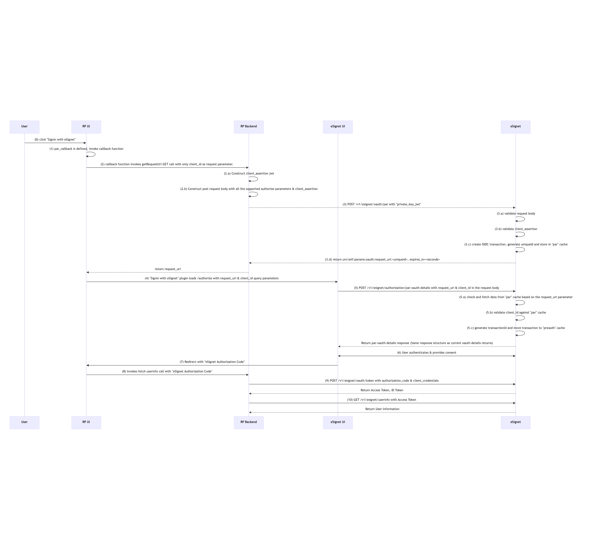

# PAR (Pushed Authorization Requests) in eSignet OIDC

Push authorization request parameters to eSignet through a secured back-channel using PAR ([RFC 9126](https://www.rfc-editor.org/rfc/rfc9126)), reducing exposure of sensitive parameters in the browser and aligning with the [FAPI 2.0 Baseline Profile](https://openid.net/specs/fapi-2_0-baseline.html).

---

## Table of Contents

- [Background](#background)
- [How It Works](#how-it-works)
- [Prerequisites](#prerequisites)
- [Configuration](#configuration)
  - [1. Server-Side Properties](#1-server-side-properties)
  - [2. Client Registration](#2-client-registration)
  - [3. Configure the Relying Party (Mock RP)](#3-configure-the-relying-party-mock-rp)
- [Verification](#verification)
- [Troubleshooting](#troubleshooting)
- [Limitations](#limitations)

---

## Background

In a traditional OIDC authorization request, all parameters (`client_id`, `scope`, `redirect_uri`, `acr_values`, etc.) travel through the user agent as query string parameters on the front-channel `/authorize` URL. This exposes the request to several risks:

- Parameters can be inspected or tampered with in browser history, server logs, and referrer headers.
- Long parameter strings (especially with rich `claims` or large `scope` lists) can exceed URL length limits.
- The authorization server has no strong guarantee the request originated from an authenticated client.

**Pushed Authorization Requests (PAR)** address these issues by letting the relying party push the full authorization request to a dedicated, authenticated back-channel endpoint *before* redirecting the user. The server stores the request and returns a short, opaque `request_uri` that the client then uses on the front-channel `/authorize` call.

**Default behavior (no PAR):**

```
Client --> /authorize?client_id=...&scope=...&redirect_uri=... (all params in URL)
```

**With PAR:**

```
Client --> POST /par (authenticated, full request in body) --> request_uri
Client --> /authorize?client_id=...&request_uri=urn:ietf:params:oauth:request_uri:...
```

Security benefits:

- Authorization request parameters are integrity-protected and authenticated at submission time.
- Sensitive parameters never appear in the browser URL bar, history, or referrer logs.
- Mitigates request tampering and certain mix-up attacks.
- Required for FAPI 2.0 conformance.

---

## How It Works

The PAR flow in eSignet follows the sequence below:

1. The user clicks **Sign in with eSignet** on the relying party's UI.
2. A callback function on the RP backend constructs the PAR payload, including all authorization request parameters and the parameters required for client authentication via `private_key_jwt`.
3. The callback calls eSignet's `/par` endpoint with this payload.
4. eSignet validates the payload and returns a `request_uri` to the RP backend.
5. The callback returns control to the RP UI, which redirects the browser to eSignet's `/authorize` endpoint with `client_id` and `request_uri` only.
6. eSignet looks up the stored request, validates it, and returns the OAuth details response.
7. On successful validation, eSignet generates a new transaction ID for the session.
8. On unsuccessful validation, eSignet returns an error which the RP portal must surface to the user.
9. eSignet authenticates the user, captures consent, and returns an authorization code to the RP redirect URI.
10. The RP exchanges the authorization code for an access token at the token endpoint.
11. The RP calls `/userinfo` with the access token to retrieve user data.

### The `request_uri` mechanism

The `request_uri` returned by `/par` has the following format:

```
urn:ietf:params:oauth:request_uri:<secure random alphanumeric string, max length 25>
```

Validated request parameters are stored in the **`par` cache** keyed by `request_uri`. Cache entries are written with a TTL, and the `expires_in` value returned in the PAR response always matches this TTL. Once the entry expires (or is consumed by a successful `/authorize` call), the `request_uri` is no longer usable.

## Sequence diagram:


---

## Prerequisites

- eSignet is deployed and operational.
- The relying party (client) is registered in the `client_detail` table.
- The client has a key pair registered for `private_key_jwt` client authentication (required at the `/par` endpoint).
- All `redirect_uri` values used by the client are pre-registered. eSignet does **not** allow non-registered redirect URIs in PAR requests.

---

## Configuration

### 1. Server-Side Properties

Configure the PAR cache TTL via `application.properties`:

| Property                            | Description                                                                 | Default |
|-------------------------------------|-----------------------------------------------------------------------------|---------|
| `mosip.esignet.par.expire-seconds`  | TTL (in seconds) for `request_uri` entries in the `par` cache. Returned as `expires_in` in the PAR response. | `60`    |

```properties
# application.properties
mosip.esignet.par.expire-seconds=60
```

### 2. Client Registration

To **enforce** PAR for a specific client (i.e., reject any direct `/authorize` calls that do not use a `request_uri`), set the following in the client configuration:

| Property                                  | Description                                                | Default |
|-------------------------------------------|------------------------------------------------------------|---------|
| `Require_pushed_authorization_requests`   | When `true`, the client must use PAR for all authorization requests. | `false` |

> When the property is `false`, PAR is still **supported** for the client — they can use it optionally. Setting it to `true` makes PAR mandatory and rejects any non-PAR `/authorize` call.

### 3. Configure the Relying Party

The eSignet mock relying party demonstrates PAR through a callback function exposed to the sign-in button plugin. Enable PAR on the mock RP UI by setting the following environment variables:

| Variable                | Description                                                                                                                          | Example            |
|-------------------------|--------------------------------------------------------------------------------------------------------------------------------------|--------------------|
| `PAR_CALLBACK_NAME`     | **Feature flag** that enables the PAR flow. The value is the hardcoded callback function name in the codebase and is **not configurable**. Include the variable to enable PAR; omit it to disable. | `get_requestUri`   |
| `PAR_CALLBACK_TIMEOUT`  | Timeout for the PAR callback, in milliseconds. *(Optional, default `5000`.)*                                                         | `5000`             |

The mock RP backend exposes the corresponding endpoint, prefixed by `MOCK_RELYING_PARTY_SERVER_URL`:

- **`/requestUri`** — Constructs the PAR payload, calls eSignet's `/par`, and returns the `request_uri` to the UI.

Example `docker run` snippet (PAR-relevant variables only):

```bash
docker run -it -d -p 5000:5000 \
  -e MOCK_RELYING_PARTY_SERVER_URL='http://esignet.dev.mosip.net/mock-relying-party-server' \
  -e PAR_CALLBACK_NAME='get_requestUri' \
  -e PAR_CALLBACK_TIMEOUT=5000 \
  <dockerImageName>:<tag>
```

> **Note:** This configuration is specific to eSignet's mock relying party. Production relying parties should implement their own `/par` callback using the client authentication scheme (`private_key_jwt`) registered with eSignet.

---

## Verification

After completing the configuration:

1. Initiate a login from the relying party portal by clicking **Sign in with eSignet**.

2. Observe a back-channel `POST` from the RP backend to eSignet's `/par` endpoint. A successful response looks like:

   ```json
   {
     "request_uri": "urn:ietf:params:oauth:request_uri:Xq8vN2pK7mR4tY9wL3sA1bC5d",
     "expires_in": 60
   }
   ```

3. Confirm the subsequent browser redirect to `/authorize` carries only `client_id` and `request_uri` — not the full set of authorization parameters:

   ```
   GET /authorize?client_id=healthservices&request_uri=urn:ietf:params:oauth:request_uri:Xq8vN2pK7mR4tY9wL3sA1bC5d
   ```

4. Complete authentication and consent. eSignet should issue an authorization code at the registered `redirect_uri`, which the RP exchanges for tokens as in the standard flow.

5. (For enforced clients) Verify that any `/authorize` request *without* a `request_uri` is rejected with an appropriate OAuth error.

---

## Troubleshooting

| Problem                                       | Possible Cause                                                            | Solution                                                                                                              |
|-----------------------------------------------|---------------------------------------------------------------------------|-----------------------------------------------------------------------------------------------------------------------|
| `/authorize` rejects the `request_uri`        | The `request_uri` has expired (TTL elapsed) or was already consumed       | Increase `mosip.esignet.par.expire-seconds`, or ensure the RP redirects the user immediately after receiving it       |
| PAR is not enforced for a client              | `Require_pushed_authorization_requests` is `false`                        | Set the property to `true` in the `client_detail` configuration for that client                                       |
| Mock RP UI does not call `/par`               | `PAR_CALLBACK_NAME` is missing or set to a value other than `get_requestUri` | Set the env var exactly to `get_requestUri`. The value is hardcoded and not configurable                              |
| `/par` returns client authentication error    | `private_key_jwt` parameters missing or invalid in the PAR payload        | Ensure the callback includes `client_assertion_type` and a valid `client_assertion` JWT signed with the client's key  |
| `/par` rejects the `redirect_uri`             | The `redirect_uri` is not pre-registered for the client                   | Register the exact `redirect_uri` in `client_detail`. Non-registered redirect URIs are not permitted                   |
| Mock RP callback times out                    | PAR endpoint slow to respond, or `PAR_CALLBACK_TIMEOUT` too low           | Increase `PAR_CALLBACK_TIMEOUT` (default `5000` ms), and check eSignet backend health                                  |
| `expires_in` does not match expected TTL      | Server property not picked up                                             | Verify `mosip.esignet.par.expire-seconds` is set in the active `application.properties` and restart eSignet            |

---

## Limitations

The following optional features from RFC 9126 / related specifications are **not** implemented in the current version of eSignet. Plan integrations accordingly:

- Client authentication parameters passed in the PAR request **header** (only body-based `private_key_jwt` is supported).
- The `request` parameter as defined in [JAR (RFC 9101)](https://www.rfc-editor.org/rfc/rfc9101) — request objects must be pushed via PAR rather than passed as signed JWTs on `/authorize`.
- API rate limiting on `/par` is delegated to infrastructure (e.g., the gateway or NGINX layer).
- Non-registered `redirect_uri` values are not accepted in PAR requests.
