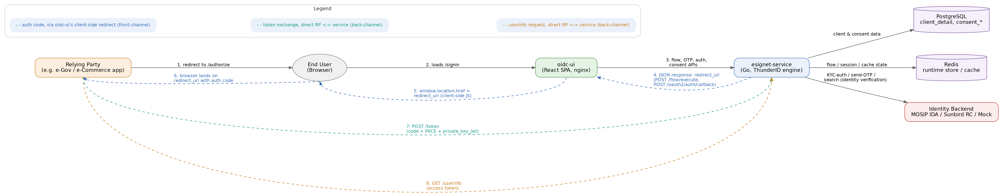
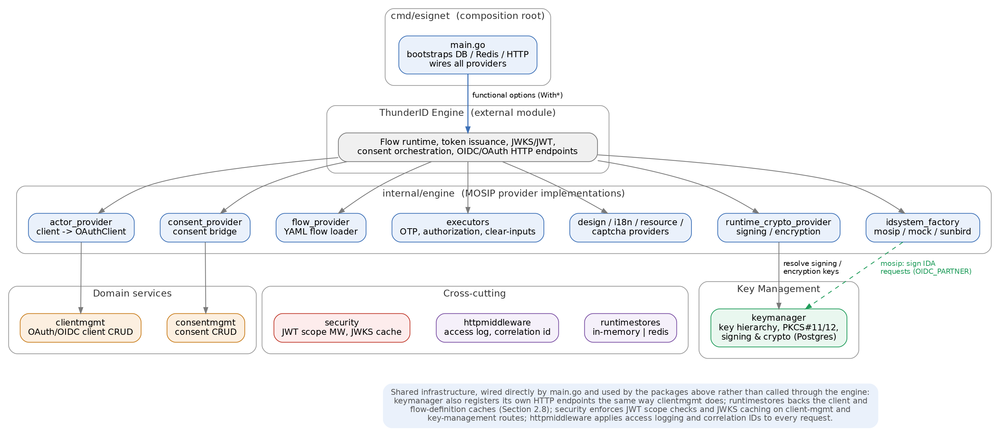
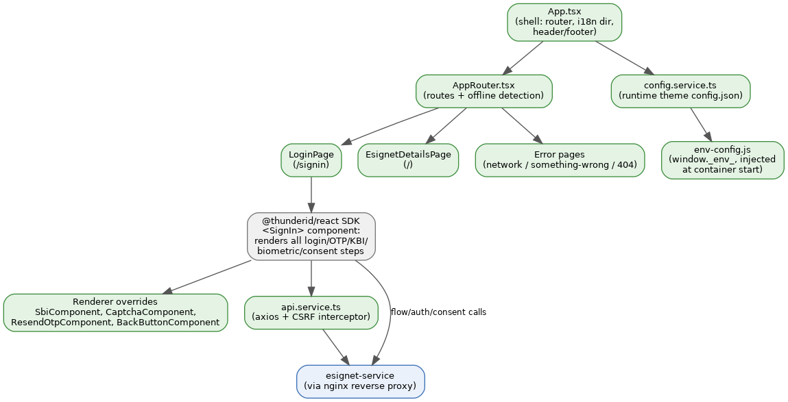
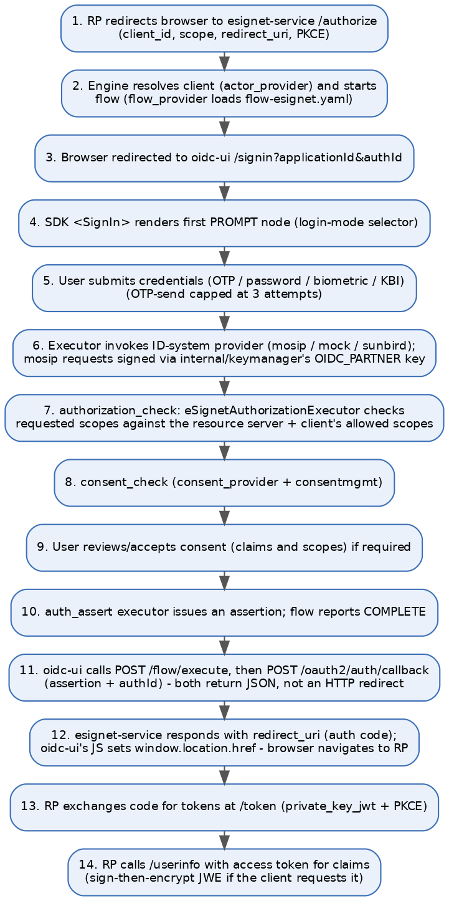

# 1. Overview

eSignet is MOSIP's OpenID Connect (OIDC) / OAuth2 identity provider (IDP). It lets a relying party (RP) — a government or private-sector application — authenticate an end user against a national or foundational identity system (e.g. MOSIP IDA, Sunbird Registered Claims, or a mock provider for testing) and receive standard OIDC tokens and claims, without the RP ever handling the user's raw identity credentials.

This document describes the architecture of the two components that were reviewed in the connected repository:

- **esignet-service** – the Go backend that implements client management, consent management, and the MOSIP-specific pieces of the OIDC engine (identity-provider plugins, authentication flows, screens, security).
- **oidc-ui** – the React/TypeScript single-page application that renders the login, OTP/biometric/KBI, and consent screens the end user interacts with.

Both components are built on top of ThunderID, a generic external OIDC/OAuth engine (`github.com/thunder-id/thunderid` on the backend, `@thunderid/react` on the frontend) that supplies the protocol machinery — token issuance, PKCE/DPoP/PAR, JWKS signing, the flow execution runtime, and the login/consent UI rendering surface. `esignet-service` and `oidc-ui` are the MOSIP-specific configuration, provider implementations, and theming layered on top of that engine.

### 1.1 System Context

The diagram below shows how a relying party, the end user's browser, the two components under review, their datastores, and the pluggable identity backend fit together.

*Figure 1 – System context*

### 1.2 Component Summary

| Component | Technology | Responsibility |
|---|---|---|
| esignet-service | Go 1.26, ThunderID engine | OIDC/OAuth protocol endpoints (via engine), client & consent management APIs, MOSIP-specific auth-flow providers, identity-backend plugins |
| oidc-ui | React 19, TypeScript, Vite, @thunderid/react | Login/OTP/biometric/KBI/consent screens, theming, CAPTCHA, error/offline handling |
| PostgreSQL | RDBMS | OAuth client registry, consent records/history, key material tables |
| Redis | In-memory store | Shared runtime store: transient flow/session state, client cache, flow-definition cache |
| Identity backend | MOSIP IDA / Sunbird RC / Mock | Actual identity verification: OTP dispatch, KYC-auth, biometric/KBI matching |

---

## 2. esignet-service (Backend)

esignet-service is a Go module (`github.com/mosip/esignet`, Go 1.26). Its entry point, `cmd/esignet/main.go`, is a composition root: it opens the Postgres and (optionally) Redis connections, builds the client-management HTTP handler, constructs an identity-backend provider via a factory, and then calls `thunderidengine.New(mux, ...)` with roughly twenty functional-option providers that plug MOSIP-specific behaviour into the generic ThunderID engine. The engine registers its own OIDC/OAuth endpoints (authorize, token, well-known discovery, JWKS, etc.) on the same `*http.ServeMux`; that route-registration code lives in the external module and is outside this repository.

### 2.1 Module Breakdown

*Figure 2 – esignet-service component composition*

| Package | Purpose |
|---|---|
| `cmd/esignet` | Composition root: config load, DB/Redis setup, HTTP mux, wiring of all engine options |
| `internal/clientmgmt` | OAuth/OIDC relying-party client registration, update, patch, lookup (REST API + Postgres) |
| `internal/consentmgmt` | User consent capture, decision hashing, history (Postgres) |
| `internal/engine` | MOSIP implementations of the ThunderID engine's provider interfaces (actor, authorization, consent bridge, flow, design, i18n, OU, resource, attestation, captcha, IDP) |
| `internal/engine/executors` | Custom flow-step executors: eSignet OTP executor, clear-inputs executor |
| `internal/engine/mosip` · `mock` · `sunbird` | Pluggable identity-verification backends selected at startup |
| `internal/engine/runtimestores` | In-memory or Redis-backed shared runtime store (flow state, caches) |
| `internal/security` | JWT bearer-token scope enforcement middleware, JWKS cache, request-time validation |
| `internal/httpmiddleware` | Access logging, correlation-ID propagation |
| `internal/config` | Environment/YAML-driven application configuration |
| `internal/common`, `internal/log` | Shared request/response envelopes and structured logging |

### 2.2 Authentication Flow Engine

Login and consent screens are not hard-coded; they are driven by declarative YAML flow definitions under `data/flows/` (`flow-esignet.yaml` is the default, `otp-flow.yaml` a simpler variant). `flow_provider.go` loads the file named after the configured `AuthFlowID`, parses it into a `CompleteFlowDefinition`, and caches it in the shared runtime store.

A flow is a state machine of nodes:

- **START / END** – flow entry and exit points.
- **PROMPT** – renders a UI screen, described as a tree of components (blocks, text, text/OTP inputs, consent widgets, custom elements) with i18n keys resolved by the i18n provider.
- **TASK_EXECUTION** – invokes a named executor (built into the engine, e.g. `CredentialsAuthExecutor`, `AuthAssertExecutor`, `ConsentExecutor`, `AuthorizationExecutor`; or MOSIP-specific, e.g. `eSignetOtpExecutor`) and branches on `onSuccess` / `onIncomplete`.

`flow-esignet.yaml` implements a multi-ACR login: a mode selector branches into OTP, password, biometric, or KBI sub-flows (each collecting a UIN/mobile/email/NRC identifier plus a CAPTCHA), converging on `authorization_check` → `consent_check` (looping back to the consent screen if incomplete) → `auth_assert` → `end`. A CAPTCHA interceptor is applied selectively to OTP-send and credential/KBI-auth nodes.

### 2.3 Pluggable Identity-System Providers

`internal/engine/idsystem_factory.go` selects one concrete authenticator at startup, keyed by the `MOSIP_ESIGNET_AUTHN_PROVIDER` environment variable (default `mock`). All three implementations satisfy the same `ConsolidatedAuthnProvider` contract (`Authenticate`, `GetEntityReference`, `GetAttributes`, `SendOTP`, `InitiateAuthentication`/`Enrollment`), so the flow executors remain provider-agnostic.

| Provider | Backend | Notes |
|---|---|---|
| `mosip` | MOSIP IDA (KYC-auth / KYC-exchange / send-OTP) | Requests encrypted with AES-256-GCM, key wrapped with RSA-OAEP against the IDA partner certificate, payload signed as a JWT (x5c) using a key loaded from a PKCS#12 file. Supports OTP, password, biometrics. |
| `sunbird` | Sunbird Registered Claims registry | KBI-only (no OTP). Exact-match search against configured KBI fields; requires exactly one match; claims released only via an explicit field mapping (fail closed on unmapped fields). |
| `mock` | In-house mock identity service | For development/testing; supports OTP, password, PIN, biometrics, or arbitrary KBI challenges; no MOSIP cryptographic envelope. |

### 2.4 Client Management

`internal/clientmgmt` models one underlying OAuth/OIDC client entity exposed through three API "profiles" (oidc-client, oauth-client, generic client) sharing the same Postgres table, `client_detail`. A client record carries its client ID/name, relying-party ID, redirect URIs, allowed claims and ACR values, signing/encryption JWKs, grant types and token-auth methods, plus a free-form `additional_config` JSON for PAR/DPoP/PKCE flags and consent expiry.

The service supports create, full update, and partial patch (with optimistic concurrency via an updated-timestamp check, and a tri-state "omitted / null / value" marker for the encryption key so callers can distinguish "leave alone" from "clear"). `GetClient` is cache-through: reads hit the shared runtime store first, and every write invalidates the cache.

**Endpoints**

| Method & Path | Purpose |
|---|---|
| `POST /client-mgmt/oidc-client` | Register a client with the OIDC profile |
| `PUT /client-mgmt/oidc-client/{client_id}` | Full update, OIDC profile |
| `POST /client-mgmt/oauth-client` | Register a client with the OAuth profile |
| `PUT /client-mgmt/oauth-client/{client_id}` | Full update, OAuth profile |
| `POST /client-mgmt/client` · `PUT /client-mgmt/client/{client_id}` | Generic client profile create/update |
| `PATCH /client-mgmt/client/{client_id}` | Partial update of selected fields |
| `GET /client-mgmt/client/{client_id}` | Fetch a client (cache-through) |

### 2.5 Consent Management

`internal/consentmgmt` ports the decision logic of the original Java eSignet consent service. A `ConsentRecord` holds the client/user pair, requested claims and authorization scopes, a deterministic hash of that request, the accepted claims/permitted scopes, and an optional expiry (null = never expires).

On each authorization request, the engine's consent provider compares a hash of the newly requested claims/scopes against the last stored consent for that (client, user) pair to decide whether to re-prompt the user (CAPTURE) or reuse the prior decision (NOCAPTURE). `SaveRecord` writes both an append-only audit row (`consent_history`) and an upserted current row (`consent_detail`) inside a single database transaction; `DeleteRecord` removes only the current row, leaving history intact.

### 2.6 Security

Two independent, composable HTTP middlewares protect the client-management API surface:

- **Scope enforcement** – `ScopeMiddleware` activates only when both an issuer URL and a JWKS URL are configured. It validates the Bearer JWT (RS/ES/PS 256/384/512, pinned issuer, mandatory expiry) against a key resolved from a polling `JWKSCache` (keyed by `kid`, with a forced refresh on a cache miss to tolerate key rotation), then checks the token's scope claim against a per-route scope mapping. Requests to a route with no configured mapping are rejected (fail closed).
- **Request-time validation** – a configurable leeway window (default 300s) rejects requests whose declared request time has drifted too far from server time, mitigating replay of captured requests.

The OIDC/OAuth protocol surface itself (token issuance, PKCE, DPoP, client authentication via `private_key_jwt`) is enforced inside the ThunderID engine and configured, not re-implemented, by esignet-service.

### 2.7 Configuration & Runtime Store

Application configuration is loaded from `data/deployment.yaml` with environment-variable interpolation, then defaulted/overridden by explicit env vars. Notable settings include the listening port, issuer host, data directory, selected authentication provider, active flow/layout/theme IDs, the runtime-store backend, cache TTLs for clients/flows/design assets, and nested engine configuration for OAuth grant/response types, JWT signing, ACR→AMR mapping, CAPTCHA validation, and outbound HTTP client tuning.

The runtime store abstracts transient state behind one interface with two implementations: an in-memory store (single instance, development/testing only — explicitly logged as not shared across replicas) and a Redis-backed store used in production for horizontal scalability. It is shared by three consumers: the engine's own flow/session state, the client-management cache, and the flow-definition cache.

### 2.8 Data Model

The service owns three tables directly (via generated, type-safe SQL access):

| Table | Purpose |
|---|---|
| `client_detail` | OAuth/OIDC client registry: identifiers, redirect URIs, claims, ACR values, JWKs, grant types, auth methods, status, additional config |
| `consent_detail` | Current consent decision per (client_id, user token): accepted claims, permitted scopes, expiry |
| `consent_history` | Append-only audit trail of every consent decision |

A shared `mosip_esignet` schema also defines `key_store`, `public_key_registry`, `key_alias`, `key_policy_def`, and `ca_cert_store` tables used by the esignet-service's own key manager for cryptographic operations.

---

## 3. oidc-ui (Frontend)

oidc-ui is a React 19 / TypeScript single-page application built with Vite. Rather than implementing login, OTP, biometric, KBI, and consent screens itself, it is a thin theming and integration shell around `@thunderid/react`, a prebuilt SDK that supplies the actual flow-driven screen rendering, OAuth state/PKCE handling, and i18n context. The app supplies branding, theme configuration, CAPTCHA provider adapters, a biometric-capture bridge, and error/offline handling around that SDK.

### 3.1 Technology Stack

| Concern | Choice |
|---|---|
| Framework | React 19.2 + TypeScript ~6.0 |
| Build tool | Vite 8 (`tsc -b && vite build`) |
| Routing | react-router-dom v7 |
| Data/query caching | @tanstack/react-query v5 |
| Styling | Tailwind CSS v4 (CSS-based config) + PostCSS/Autoprefixer |
| Core domain SDK | @thunderid/react v0.11.0 – SignIn/flow renderer, ThunderIDProvider, I18nProvider |
| CAPTCHA | Google reCAPTCHA, Cloudflare Turnstile, hCaptcha (selectable) |
| Biometrics | @mosip/secure-biometric-interface-integrator |
| Testing | Vitest + Testing Library, jsdom, 80% coverage threshold |

### 3.2 Structure

*Figure 3 – oidc-ui component composition*

| Folder | Contents |
|---|---|
| `src/App.tsx`, `src/routes/` | Root shell and route table (query client, RTL/i18n sync, header/footer, offline detection) |
| `src/pages/` | LoginPage, EsignetDetailsPage, NetworkErrorPage, SomethingWrongPage, PageNotFoundPage – only five app-level pages; the login/OTP/consent screens themselves live inside the SDK |
| `src/components/` | Renderer overrides passed into the SDK: biometric capture bridge, CAPTCHA adapter, resend-OTP control, back button, header/footer/loading chrome |
| `src/services/` | `api.service.ts` (axios + CSRF), `config.service.ts` (runtime theme config), `css-variable.service.ts` (logo/image CSS variables) |
| `src/constants/` | Route paths, loading-state enum, public asset/image paths |
| `src/hooks/` | `useAppTranslation` – wraps the SDK's i18n context with English fallbacks |
| `public/` | `env-config.js` (runtime env), `theme/config.json` + `variables.css`, images, favicon |
| `nginx/`, `Dockerfile`, `configure_start.sh` | Production build/serve configuration |

### 3.3 Routing & Screens

| Route | Page | Behaviour |
|---|---|---|
| `/` | EsignetDetailsPage | Displays the OIDC well-known endpoint list decoded from runtime config |
| `/signin` | LoginPage | Validates `applicationId`/`authId` query params, then renders the SDK's `<SignIn>` component, which drives every login, OTP, KBI, biometric, and consent step from the backend flow definition |
| `/something-went-wrong` | SomethingWrongPage | Reached via the axios error interceptor; receives the HTTP status via router state |
| `/network-error` | NetworkErrorPage | Reached when react-detect-offline detects the browser is offline |
| `*` | PageNotFoundPage | Fallback |

There is no separate app route per screen (OTP entry, consent review, biometric capture, etc.) — those are step types rendered inside the single SDK flow component, matching the backend's PROMPT-node model described in section 2.2. The app customises specific step renderers (e.g. the CAPTCHA box, the biometric-capture widget, the resend-OTP and back-button controls) by injecting overrides into the SDK.

### 3.4 Backend Integration

`api.service.ts` wraps axios with credentials enabled and a base URL derived from `VITE_API_URL` (`/v1/esignet` in production). A request interceptor fetches and caches a CSRF token from `GET {base}/csrf/token`, attaching it as an `X-XSRF-TOKEN` header on state-changing requests; a response interceptor redirects to `/something-went-wrong` on any 4xx/5xx. The SDK's `ThunderIDProvider` is initialised with the same base URL and the `applicationId` query parameter, and internally issues the actual flow/OTP/consent/token calls against esignet-service.

In production, nginx proxies `/v1/esignet/*` to the esignet-service backend, along with the OIDC discovery endpoints (`/.well-known/openid-configuration`, `/.well-known/jwks.json`, `/.well-known/oauth-authorization-server`).

### 3.5 Configuration & Theming

Per-deployment configuration is injected at container start rather than baked into the build: `public/env-config.js` sets `window._env_` (default language, well-known URL, theme, favicon, title, ID-provider display name), generated by `configure_start.sh` from Docker build arguments. The same script downloads and unzips externally hosted i18n, theme, and image bundles into the served static tree — the frontend analogue of the backend's `data/i18n` and `data/themes` YAML assets, delivered as static files rather than fetched live from an API. A runtime `theme/config.json` (fetched by `config.service.ts`) carries boolean UI feature flags (e.g. OTP/biometrics info icons, background logo, footer, outline toggle), and CSS custom properties are injected for logo and background image URLs.

### 3.6 Build & Deployment

A multi-stage Dockerfile builds the Vite bundle in a `node:20-alpine` stage and serves it from an `nginx:1.28-alpine` stage as a non-root user, also fetching a "sign-in-with-esignet" plugin bundle at image build time. `configure_start.sh` runs at container start to fetch theming/i18n/image bundles, rewrite public-path placeholders for sub-path deployments, and generate `env-config.js` before starting nginx, which serves the SPA with an `index.html` fallback and reverse-proxies API/discovery calls to the backend. The `helm/oidc-ui` chart provides a standard Kubernetes Deployment/Service/ConfigMap plus Istio VirtualService/Gateway and a Prometheus ServiceMonitor, alongside mock relying-party test fixtures.

### 3.7 Notable UX & Security Features

- Pluggable CAPTCHA provider (Google reCAPTCHA, Cloudflare Turnstile, or hCaptcha) selected by runtime configuration.
- CSRF protection via a fetched token attached to state-changing requests.
- OAuth state/PKCE handling performed inside the SDK, not re-implemented in this repository.
- Centralised error handling: HTTP errors redirect to a dedicated error page carrying the status code; offline detection redirects to a network-error page.
- Right-to-left layout support and language switching for internationalisation.
- Biometric capture bridged to the MOSIP Secure Biometric Interface device SDK, auto-submitting the form on a successful scan.

---

## 4. End-to-End Authentication Flow

The sequence below traces a typical authorization-code login from relying-party redirect to token exchange, showing how the two components and the identity backend cooperate.

*Figure 4 – End-to-end login and consent sequence*

---

## 5. Key Architectural Characteristics

- **Engine-and-plugin separation** – protocol mechanics (token issuance, JWKS, PKCE/DPoP/PAR, flow execution runtime, UI-rendering surface) live in the shared, external ThunderID engine/SDK; esignet-service and oidc-ui contribute only MOSIP-specific providers, screen theming, and identity-backend integrations. This keeps the MOSIP-specific codebase small and lets the protocol core be upgraded independently.
- **Flow-as-configuration** – authentication and consent journeys are declarative YAML (backend) rendered generically by a single SDK component (frontend), so new login methods or screen orders can be introduced without new app routes or backend endpoints, only new flow nodes and, where needed, new executors.
- **Swappable identity backend** – MOSIP IDA, Sunbird RC, and a mock provider all satisfy one authenticator interface, selected by a single environment variable, enabling the same UI/flow layer to run against production identity systems or a local mock for testing.
- **Defence in depth on the API surface** – client-management APIs are protected independently by scope-checked bearer tokens and request-time/replay validation, in addition to the OIDC/OAuth security enforced by the engine on the protocol endpoints.
- **Cache-through shared runtime store** – a single Redis-or-in-memory store backs client lookups, flow-definition caching, and the engine's own session/flow state, with Redis required for any multi-replica deployment.
- **Externalised, per-deployment theming** – language packs, themes, layouts, and images are treated as deployable configuration (YAML on the backend, downloaded static bundles plus a runtime `env-config.js` on the frontend) rather than being compiled into either artifact, allowing one build to serve multiple branded deployments.

---

## 6. Appendix

### 6.1 esignet-service Endpoints Registered in This Repository

| Method & Path | Auth |
|---|---|
| `GET /health` | None |
| `POST` / `PUT /client-mgmt/oidc-client[/{client_id}]` | Scope-checked bearer token (if configured) |
| `POST` / `PUT /client-mgmt/oauth-client[/{client_id}]` | Scope-checked bearer token (if configured) |
| `POST` / `PUT` / `PATCH` / `GET /client-mgmt/client[/{client_id}]` | Scope-checked bearer token (if configured) |

Standard OIDC/OAuth endpoints (`/authorize`, `/token`, `/.well-known/openid-configuration`, JWKS publishing, PAR, revocation, logout) are registered by the external ThunderID engine on the same mux and are outside this repository's own route-registration code.

### 6.2 Key Environment-Driven Configuration

| Variable | Effect |
|---|---|
| `PORT` | HTTP listen port (default 8088) |
| `MOSIP_ESIGNET_HOST` | OIDC issuer URL |
| `MOSIP_ESIGNET_AUTHN_PROVIDER` | Selects the identity backend: `mosip` \| `sunbird` \| `mock` |
| `MOSIP_ESIGNET_AUTH_FLOW_ID` | Selects the active flow YAML under `data/flows/` |
| `MOSIP_ESIGNET_LAYOUT_ID`, `MOSIP_ESIGNET_THEME_ID` | Selects the active layout/theme YAML under `data/` |
| `RuntimeDBType` (config) | Selects Redis vs. in-memory runtime store |
| `CRYPTO_ENCRYPTION_KEY` | Required; service fails to start if unset |
| `ISSUER_URL`, `JWKS_URL` (security_config) | Enable scope-enforcement middleware when both are set |
| `VITE_API_URL` (oidc-ui build) | Backend base path, e.g. `/v1/esignet` |

