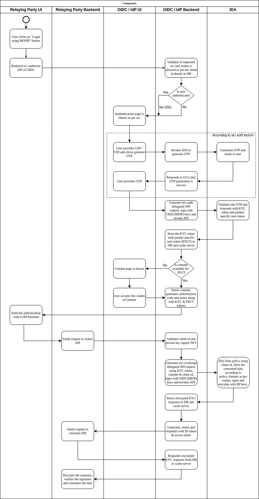
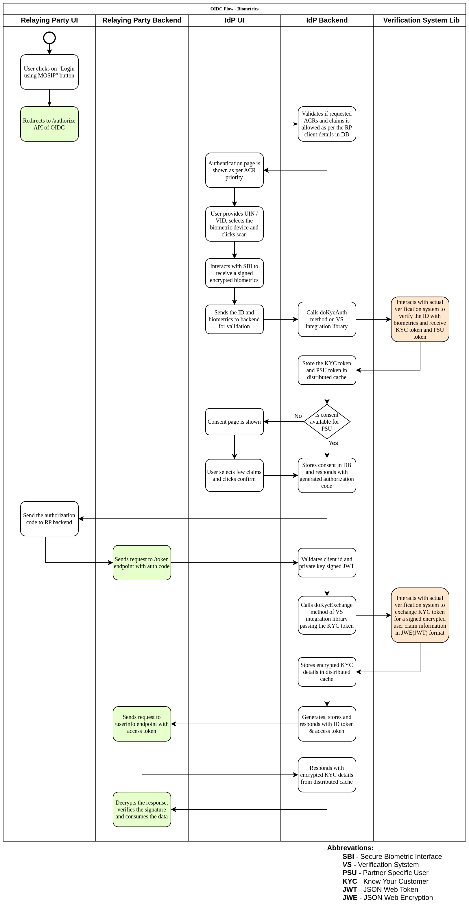

# Overview

eSignet offers a seamless and straightforward solution for incorporating an existing trusted identity database into the 
digital realm via plugins.

## Design Objectives

1. Should be an overlay solution on top of any of the existing identity API. Users can adopt the IDP solution and plugin the backend identity verification against their existing identity registry.
2. Should be able to independently operate without much dependency on existing services of MOSIP
3. Support all the mandatory features of OIDC (Open ID Connect) specification so the solution can be OIDC certified
4. When there are multiple options for a OIDC feature, support only the most secure option.
5. All integration libraries to ID system should be a runtime plugable to reuse the official container images which helps with easier upgrades.
6. Number of containers / runable applications to be kept to a minimum to avoid management overhead.
7. Standard interfaces to be used as much as possible for integrations between components
8. Should manage all the transactional data in expiring cache to increase data retrieval performance
9. The API endpoint exposed should be stateless (avoid stickiness) to support better horizontal scaling.
10. IAM based API authorization should have configuration to switched off to allow external network based mechanisms to control authorization and avoid high dependency on IAM system
11. All personally identifiable information (PII) should be kept encrypted in storage and transit

## Authorization code flow

## Authorization code flow using biometric authentication

