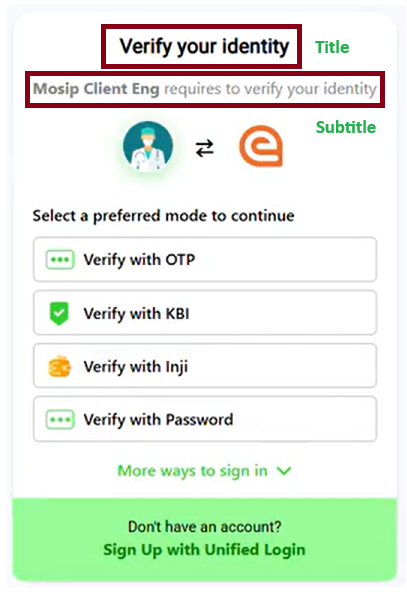

# Login with Purpose

It is a page that can be loaded with any one of the following components.

  - Login with ***\<AUTH_FACTOR>***
  - Verify with ***\<AUTH_FACTOR>***
  - Link using ***\<AUTH_FACTOR>***

  These Login/Verify/Link are the purpose for the authorization, whatever your need you have to specify your purpose while creating a client. You can check the `Create OIDC Client` api in this [Postman Collection](../../postman-collection/eSignet.postman_collection.json). There is a `purpose` object inside of it where you can define all the details.  

  ```ts
  "request": {
    ...
    "additionalConfig": {
      ...
      "purpose": {
        // Type of authorization, it is case-sensitive
        // valid values `login` | `verify` | `link` | `none`
        "type": "verify",
        // Title: It will appear in the screen as the title of login page,
        // It will be multilingual language map and @none when no language 
        // map is present, @none is compulsory if your providing title object
        "title": {
          "ara": "تحقق من هويتك",
          "eng": "Verify your identity",
          "hin": "अपनी पहचान सत्यापित करें",
          "kan": "ನಿಮ್ಮ ಗುರುತನ್ನು ಪರಿಶೀಲಿಸಿ",
          "tam": "உங்கள் அடையாளத்தை சரிபார்க்கவும்",
          "@none": "Verify your identity @none"
        },
        // Subtitle: It will appear in the screen below the title of login page,
        // It will also be multilingual language map and @none when no language
        // map is present, @none is compulsory if your providing subTitle object
        "subTitle": {
          "ara": "يرجى تقديم التفاصيل التالية للتحقق من هويتك",
          "eng": "Please provide the following details to verify your identity",
          "hin": "कृपया अपनी पहचान सत्यापित करने के लिए निम्नलिखित विवरण प्रदान करें",
          "khm": "ನಿಮ್ಮ ಗುರುತನ್ನು ಪರಿಶೀಲಿಸಲು ಕೆಳಗಿನ ವಿವರಗಳನ್ನು ನೀಡಿ",
          "tam": "உங்கள் அடையாளத்தை சரிபார்க்க கீழே உள்ள விவரங்களை வழங்கவும்",
          "@none": "Please provide the following details to verify your identity @none"
        }
      },
      ...
    }
    ...
  }
  ```

  If we use the above configuration then it will look like below image:

  

  Each component allows the user to authenticate in a different way. Each component is mapped to an auth-factor constant.
  For example

  - BIO: Biometrics
  - OTP: OTP
  - PIN: PIN
  - PWD: Password
  - KBI: Details (Knowledge based identification)
  - WLA: Wallet based

  The initialization of the component on this page is contingent upon the authentication factors received from the oauth-details endpoint. These authentication factors are determined based on the acr_values parameter specified in the authorize request.

  Each authentication method, except KBI, allows users to log in using configured multiple ID types such as Mobile Number, NRC ID, VID, and Email, with support for both prefixes and postfix.

  - Configuration Details:
  The configuration for rendering multiple login IDs is defined in the application-default.properties file of the esignet-service. If mosip.esignet.ui.config.login-id.options is set to an empty string, null, or an empty array, the UI defaults to using VID login as the fallback login ID.

  - Configuration Example:
    ```properties
    mosip.esignet.ui.config.login-id.options={ \
    { "id": "mobile", "svg": "mobile_icon", "prefixes": [{"label": "IND", "value": "+91", "maxLength": "", "regex": ""}, {"label": "KHM", "value": "+855"}], "postfix": "@phone", "maxLength": "", "regex": "" }, \ 
    { "id": "nrc", "svg": "nrc_id_icon", "prefixes": "", "postfix": "@NRC", "maxLength": "", "regex": "" }, \
    { "id": "vid", "svg": "vid_icon", "prefixes": "", "postfix": "@ID", "maxLength": "", "regex": "" }, \
    { "id": "email", "svg": "email_icon", "prefixes": "", "postfix": "@email", "maxLength": "", "regex": "" } \
    } 
    ```
  
      - Each ID configured in `mosip.esignet.ui.config.login-id.options` will create a button for the user to select and use as a login ID type.

      - To update the language for buttons, input labels, and placeholders, modify the loginOptions object in the i18n bundle files. Ensure that any new ID added to the configuration is consistently defined with the same ID name across the buttons, input labels, and placeholders objects within the i18n bundle files.

      - The svg value specified in the configuration must match the name of the SVG icon located in the images folder to ensure proper rendering in the UI.

      - The prefix should be either plain text or an array of objects to support multiple prefixes.
      For mobile login with multiple prefixes, it is recommended to use the ISO 3166-1 alpha-3 country code as the label in the configuration. This code will be used to display the corresponding country flag in the UI. (Reference: [ISO 3166-1 country codes](https://en.wikipedia.org/wiki/List_of_ISO_3166_country_codes)).
      The postfix should always be a single text value.

      - The maxLength and regex properties are optional for prefixes. If specified within a prefix, the values from the prefix will take precedence; otherwise, the outer values will be used. This follows a scope hierarchy where the inner scope takes priority over the outer scope.

  The password-based authentication system incorporates a functionality allowing users to initiate a password recovery process through a designated `Forgot Password` hyperlink.

  For knowledge based identification, the form schema is defined in the property : `auth.factor.kbi.field-details`.

  Example: 
  ```properties
  auth.factor.kbi.field-details={{"id":"policyNumber", "type":"text", "format":""},{"id":"fullName", "type":"text", "format":""},{"id":"dob", "type":"date", "format":"dd/mm/yyyy"}}
  ```

Note: The labels for the KBI form is fetched from i18 bundle of OIDC-UI.