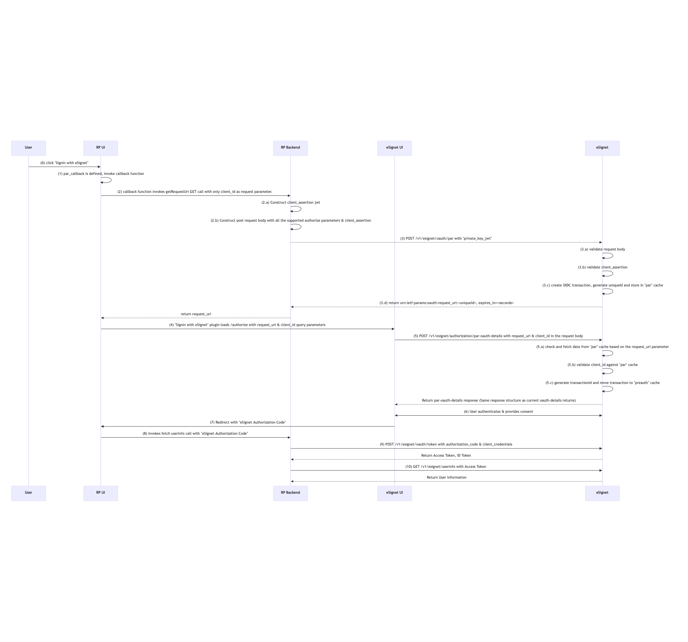
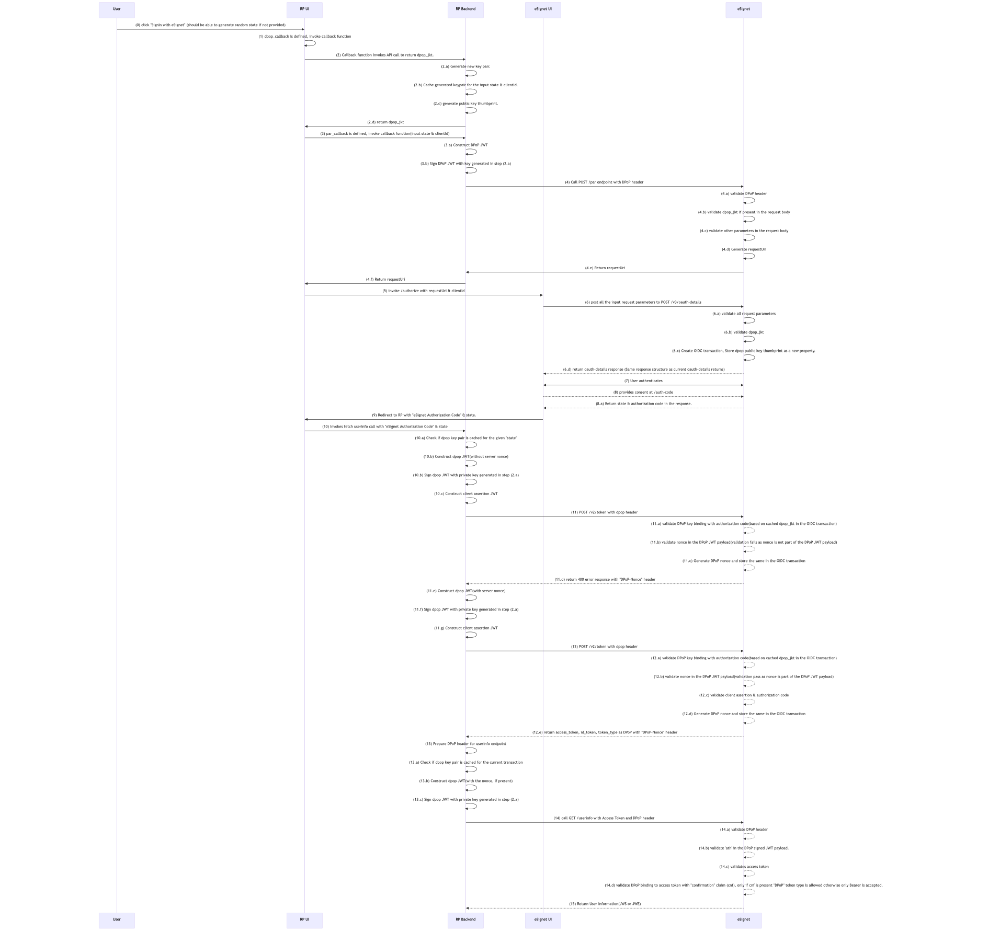
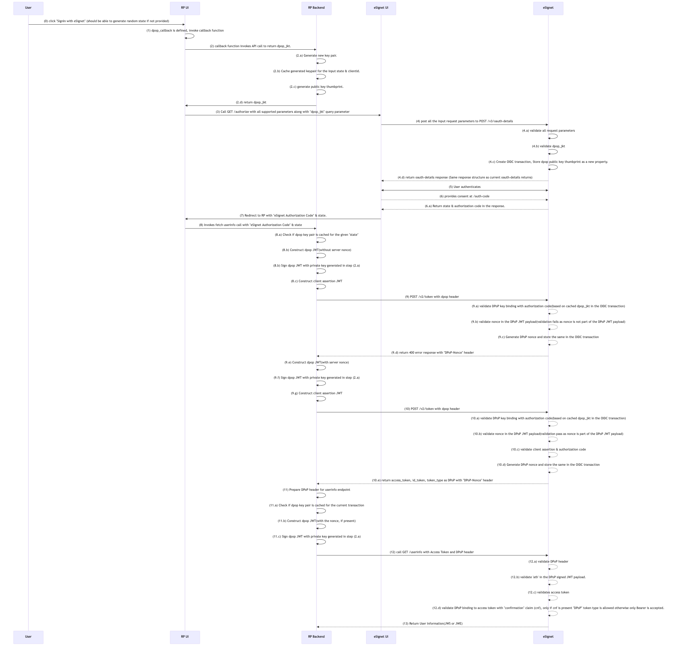

# Overview

This document describes the design and implementation details of the FAPI2 compliance features in eSignet.
It covers the following features:
- Pushed Authorization Requests (PAR)
- DPoP Support
- Issuer Identifier & Discovery

# Pushed Authorization Requests (PAR)

All the required features as per the [PAR](https://www.rfc-editor.org/rfc/rfc9126) are implemented.

1. User clicks the Sign in with eSignet button on the RP’s UI.
2. Callback function (implemented on RP backend) constructs the payload for par endpoint. Parameters required for the client authentication using private_key_jwt approach must be included in the payload.
3. Callback function calls the par endpoint in the eSignet backend with the constructed payload.
4. par endpoint validates the payload and returns the request_uri to the RP backend service.
5. Callback function receives the request_uri and calls the existing /authorize URL with client_id and request_uri.
6. eSignet validates the request parameters and returns oauth details response.
7. Upon successful validation, a new transaction id is generated.
8. On unsuccessful validation, an error should be returned, and the same error should be displayed to the user on the relying party portal.
9. eSignet authenticates the user, processes consent, and returns an authorization code.
10. RP exchanges the auth code for an access token.
11. RP uses the token to call the userinfo endpoint and retrieve user data.

**request_uri** should be in this format: 'urn:ietf:params:oauth:request_uri:<secure random alpha-numeric string with max length of 25>'.

Successfully verified request parameters should be stored in the "par" cache with request_uri as the key. Objects in the "par" cache are set with TTL. 
TTL should be configurable and the expires_in parameter in the response should return same value.

**mosip.esignet.par.expire-seconds** property in the application.properties file can be used to configure the TTL. Default value is 60 seconds.

Below Optional features are not implemented in the current version:
* client authentication parameters in the PAR request header.
* The request parameter as defined in JAR [RFC9101](https://www.rfc-editor.org/rfc/rfc9101).
* API rate limit is left to the infra to handle.
* Use of non-registered redirect_uri's are not allowed.

## Client Configuration:

**require_pushed_authorization_requests** property in the client configuration should be set to true to enforce PAR.

## Sequence diagram:

# DPoP Support

All the required features as per the [DPoP](https://datatracker.ietf.org/doc/html/rfc9449) are implemented. 
We support binding of access tokens and authorization codes to DPoP proofs. When creating a clientId, the relying party must provide the **dpop_bound_access_tokens** property. This indicates whether DPoP should be enabled or disabled, and the system will enforce validation accordingly.

- DPoP validation filter checks JWT structure, claims, and signature.
- Validates binding between access token and DPoP proof using `ath` and `cnf` claims.
- Returns RFC-compliant error responses for invalid DPoP proofs.

## Sequence of events for DPoP with Authorization Code Flow

1. User initiates login at the RP (Client) using client ID.
2. Authorization code binding should be done with dpop, by providing either the dpop_jkt query parameter or a DPoP header.
3. **_with Par:_** Client calls the /par endpoint with the required parameters including dpop_jkt query parameter or a DPoP header.
4. **_without Par:_** Client calls the /authorize endpoint with the required parameters including dpop_jkt query parameter.
5. eSignet validates the request, and stores the dpop_jkt in the OIDC transaction cache object. This acts as a binding between the public key thumbprint and the authorization code.
6. eSignet returns the authorization code to the client after user authentication and consent.
7. Client makes a call to the /v2/token endpoint with the authorization code and the DPoP header.
8. eSignet validates the DPoP header and checks the binding between the authorization code and the public key thumbprint if exists.
9. If the binding check fails, eSignet rejects the request even when **dpop_bound_access_tokens** is set to false.
10. If the DPoP header is missing or binding check fails, eSignet rejects the request if **dpop_bound_access_tokens** is set to true for the client.
11. eSignet returns an access token with:
    * token_type set to "DPoP"
    * a cnf.jkt field (confirmation method for public key binding) holds the public key thumbprint.
12. eSignet always rejects the first request, responding with a dpop_nonce header.
13. The client retries the token request with a new DPoP JWT including the nonce claim 
14. Client uses the dpop bound access token to call the /userinfo endpoint with a DPoP header.
15. eSignet validates the DPoP header and the binding between the access token and the public key thumbprint.
16. eSignet returns the user information to the client.

## Client Configuration:

**dpop_bound_access_tokens** property in the client configuration should be set to true to enforce DPoP.

## Sequence diagram DPoP with PAR:

## Sequence diagram DPoP without PAR:

# Issuer Identifier & Discovery

From 1.7.0 release, eSignet by default returns the correct issuer identifier in redirection responses and discovery documents. This is done
as per the [OAuth 2.0 Authorization Server Issuer Identification](https://www.rfc-editor.org/rfc/rfc9207).

- The issuer identifier is picked from the **mosip.esignet.domain.url** property in the application.properties file.
- The same issuer identifier is included in the `iss` claim of ID & access tokens.
- Clients MUST ensure they are using the correct issuer when making token requests.

## PAR and DPoP support with mock RP:

eSignet mock RP application provides a callback functions to demonstrate the PAR and DPoP features. 
Refer to the [README](https://github.com/mosip/esignet-mock-services/tree/master/mock-relying-party-ui#api-endpoints) for more details.

# Error Handling

- Returns standardized error codes and descriptions.
- Does not leak sensitive information in error responses.

# References

- [OpenID FAPI2 Baseline Profile](https://openid.net/specs/fapi-2_0-baseline.html)
- [OAuth 2.0 Demonstrating Proof-of-Possession](https://datatracker.ietf.org/doc/html/rfc9449)
- [DPoP](https://datatracker.ietf.org/doc/html/rfc9449)
- https://danielfett.de/2020/05/04/mix-up-revisited/
