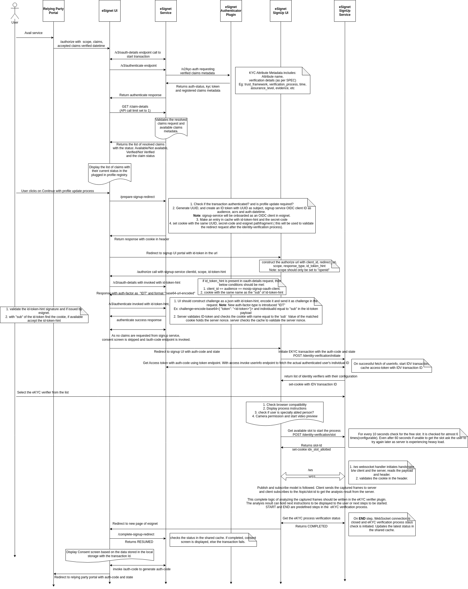

# Overview

A relying party could request for verified claims using the claims request parameter. eSignet pulls the existing claims 
metadata on successful authentication of the user. If the existing claims metadata does not suffice the relying party request 
then eSignet prompts the user to go through eKYC verification process. To handle eKYC verification process user will be 
redirected to eSignet signup portal. On successful eKYC verification process, verified claim and its verification details 
are stored in the integrated ID registry. As the verified claim and its metadata is stored, eSignet will be able to serve 
the relying party's verified claims request.

User must consent to go through the eKYC verification process. if the user denies to take the verification process, then
it is considered as consent rejection to share the requested verified claims with the relying party.

If any one of the requested verified claim is mandatory, then user is prompted to go through eKYC verification process. 
On confirmation, user is redirected to signup portal to carry out the verification process. If all the
requested verified claims are optional, no prompt is displayed. User is directly taken to the consent screen.
Option to choose eKYC verification process is supposed to be displayed in the consent screen in the later case(not implemented).

# Changes required in eSignet

* Authenticator interface:
  * On successful authentication, integrated IDA system should return back claims metadata of an authenticated user.
  * On KYC exchange, requested verified claims should be sent to the kyc_exchange method so the plugin should have all 
  the requested details to build the userinfo JWT with the requested verified claim details.

* OIDC UI:
  * After successful authentication, display requested claim availability & verification status to the user. So user can 
  take well-informed decision to agree or deny eKYC verification process.
  * Authenticated user should be able to start a verification process in signup portal with the same authenticated context. 
  ID token based authentication of the user should be provisioned.
  * If no claims are requested by the relying party, consent screen should be skipped.
  * Logic to handle flawless resume of OIDC transaction after successful eKYC verification process.
  
* Authorization Controller:
  * oauth-details endpoint should support verified_claims in the current claims request parameter.
  * consent-management should be modified to consider verified claims.
  * id_token_hint request parameter part of the OIDC protocols 'authorize' call should be supported and should be be only
  allowed for signup portal OIDC client ID.
  * v3/authenticate endpoint should support new 'IDT' ACR and support ID token based authentication only when a cookie 
  exists with name equal to the 'sub' in the input ID token. Value of the matching cookie should have valid server nonce.
  * New endpoint to fetch authenticated user's claim status in the integrated ID system. Mainly availability and verification status. 

# Sequence diagram:

