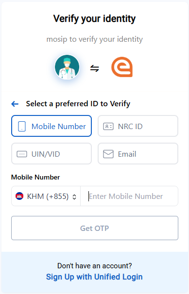

# Overview

Supports multiple configurable login ID types (e.g., Mobile Number, NRC ID, VID, Email), allowing users to log in using any of them, with optional **prefix** and **postfix** handling.

> ⚠️ **Note**: This feature is not applicable to **KBI authentication**, as input fields are dynamically rendered based on configuration.

---

## Configuration

The configuration for rendering multiple login IDs is defined in the `application-default.properties` file of the `esignet-service`.

If `mosip.esignet.ui.config.login-id.options` is set to an empty string, `null`, or an empty array, the UI defaults to using **VID login** as the fallback login ID.

- Example:
  ```properties
  mosip.esignet.ui.config.login-id.options={ \
  { "id": "mobile", "svg": "mobile_icon", "prefixes": [{"label": "IND", "value": "+91", "maxLength": "", "regex": ""}, {"label": "KHM", "value": "+855"}], "postfix": "@phone", "maxLength": "", "regex": "" }, \ 
  { "id": "nrc", "svg": "nrc_id_icon", "prefixes": "", "postfix": "@NRC", "maxLength": "", "regex": "" }, \
  { "id": "vid", "svg": "vid_icon", "prefixes": "", "postfix": "@ID", "maxLength": "", "regex": "" }, \
  { "id": "email", "svg": "email_icon", "prefixes": "", "postfix": "@email", "maxLength": "", "regex": "" } \
  } 
  ```

    - Each ID configured in `mosip.esignet.ui.config.login-id.options` will create a button for the user to select and use as a login ID type.

    - To update the language for buttons, input labels, and placeholders, modify the loginOptions object in the i18n bundle files. Ensure that any new ID added to the configuration is consistently defined with the same ID name across the buttons, input labels, and placeholders objects within the i18n bundle files.

    - The svg value specified in the configuration must match the name of the SVG icon located in the images folder to ensure proper rendering in the UI.

    - The prefix should be either plain text or an array of objects to support multiple prefixes.

    -  For mobile login with multiple prefixes, it is recommended to use the ISO 3166-1 alpha-3 country code as the label in the configuration. This code will be used to display the corresponding country flag in the UI. (Reference: [ISO 3166-1 country codes](https://en.wikipedia.org/wiki/List_of_ISO_3166_country_codes)).
      
    - The postfix should always be a single text value.

    - The maxLength and regex properties are optional for prefixes. If specified within a prefix, the values from the prefix will take precedence; otherwise, the outer values will be used. This follows a scope hierarchy where the inner scope takes priority over the outer scope.
  
Here is an image which shows the different login button for different options, by using the above configuration:


